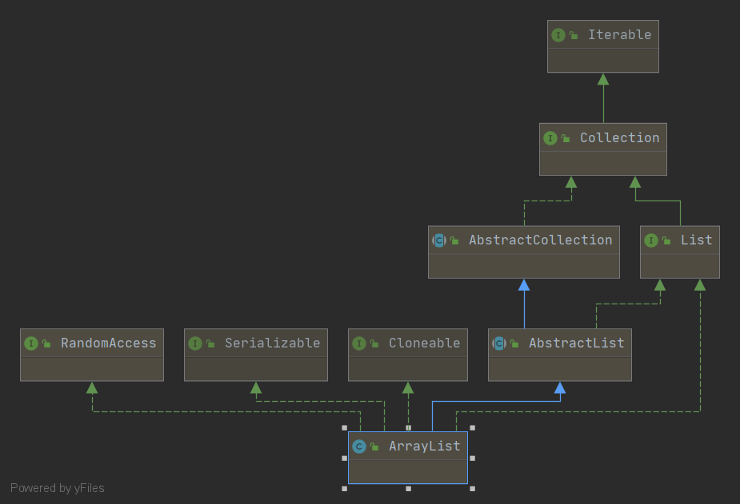
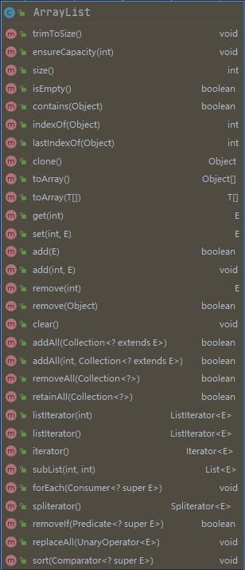

## ArrayList全局变量
````
底层存储数据的数组
transient Object[] elementData;

默认初始容量
private static final int DEFAULT_CAPACITY = 10;

空元素数据数组
private static final Object[] EMPTY_ELEMENTDATA = {};

默认容量的空元素数组
private static final Object[] DEFAULTCAPACITY_EMPTY_ELEMENTDATA = {};

ArrayList元素个数
private int size;
````
## ArrayList 构造函数
一共有3种构造函数，分别是无参构造函数、给定初始容量的构造函数以及参数是集合类的构造函数。

#### 无参构造函数
````
/**
 * Constructs an empty list with an initial capacity of ten.
 * 构造一个初始容量为10的空列表
 */
public ArrayList() {
    //将默认容量的空数组赋值给elementData
    this.elementData = DEFAULTCAPACITY_EMPTY_ELEMENTDATA;
}
````
#### 给定初始容量的构造函数
````
/**
 * Constructs an empty list with the specified initial capacity.
 * 构造一个具有初始容量的空列表
 *
 * @param  initialCapacity  the initial capacity of the list
 * @throws IllegalArgumentException if the specified initial capacity
 *         is negative
 */
public ArrayList(int initialCapacity) {
    if (initialCapacity > 0) {
        //如果初始容量大于0，将创建一个指定大小的空数组赋值给elementData
        this.elementData = new Object[initialCapacity];
    } else if (initialCapacity == 0) {
        //如果初始容量等于0，将空数组赋值给elementData
        this.elementData = EMPTY_ELEMENTDATA;
    } else {
        //如果初始容量小于0，将抛出非法参数异常
        throw new IllegalArgumentException("Illegal Capacity: "+
                                           initialCapacity);
    }
}
````
#### 参数是集合类的构造函数
````
/**
 * Constructs a list containing the elements of the specified
 * collection, in the order they are returned by the collection's
 * iterator.
 * 按照集合的迭代器返回的顺序构造一个包含指定集合元素的列表
 *
 * @param c the collection whose elements are to be placed into this list
 * @throws NullPointerException if the specified collection is null
 */
public ArrayList(Collection<? extends E> c) {
    elementData = c.toArray();
    if ((size = elementData.length) != 0) {
        // c.toArray might (incorrectly) not return Object[] (see 6260652)
        if (elementData.getClass() != Object[].class)
            elementData = Arrays.copyOf(elementData, size, Object[].class);
    } else {
        // replace with empty array.
        this.elementData = EMPTY_ELEMENTDATA;
    }
}
`````
## ArrayList类图


## ArrayList方法详解


#### add()详解
````
/**
 * Appends the specified element to the end of this list.
 * 将指定元素增加到列表末尾
 *
 * @param e element to be appended to this list
 * @return <tt>true</tt> (as specified by {@link Collection#add})
 */
public boolean add(E e) {
    //每增加一个元素都需要确认数组是否有空间，如果空间不足需要扩容
    ensureCapacityInternal(size + 1);  // Increments modCount!!
    //将元素放在数组的相应位置上
    elementData[size++] = e;
    return true;
}


private void ensureCapacityInternal(int minCapacity) {
    //如果
    if (elementData == DEFAULTCAPACITY_EMPTY_ELEMENTDATA) {
        minCapacity = Math.max(DEFAULT_CAPACITY, minCapacity);
    }

    ensureExplicitCapacity(minCapacity);
}

private void ensureExplicitCapacity(int minCapacity) {
    modCount++;

    // overflow-conscious code
    if (minCapacity - elementData.length > 0)
        grow(minCapacity);
}

private void grow(int minCapacity) {
    // overflow-conscious code
    int oldCapacity = elementData.length;
    int newCapacity = oldCapacity + (oldCapacity >> 1);
    if (newCapacity - minCapacity < 0)
        newCapacity = minCapacity;
    if (newCapacity - MAX_ARRAY_SIZE > 0)
        newCapacity = hugeCapacity(minCapacity);
    // minCapacity is usually close to size, so this is a win:
    elementData = Arrays.copyOf(elementData, newCapacity);
}